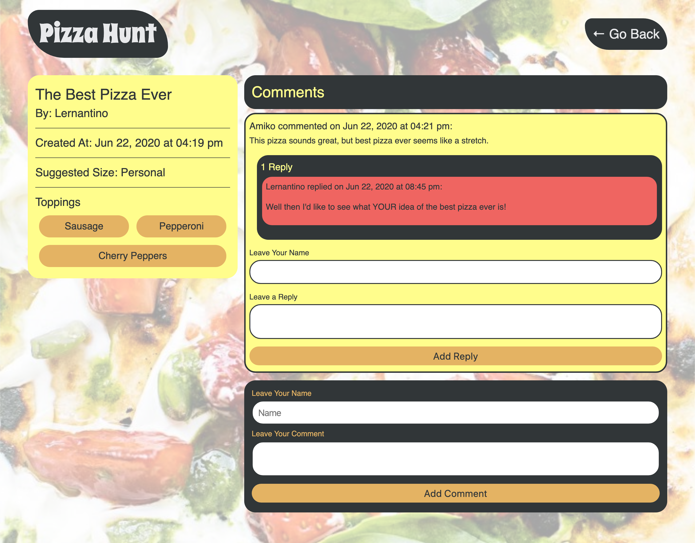

# Pizza-Hunt

Pizza Hunt—a self-aware riff on social-media applications that already exist for other topics—lets users connect with each other based on their love of pizza. In Pizza Hunt, users can share and discuss their dream pizza-topping combinations. Pizza is ubiquitous in everyday life all over the world, and no application has ever been created with the sole purpose of facilitating discussions about it.

## Built With
- HTML
- CSS
- Mongoose
- Mongo 
- JavaScript
- Node.js
- Express.js

## Description

### User Story

### Acceptance Criteria

## Install

Clone project.
Run the following line of code in your terminal to install all the needed packages: 
```
npm i
```

### Website Link
<!-- Check out the deployed app here: [Note Taker](https://calm-taiga-46703.herokuapp.com/) -->

### Screenshots


<!--   -->

### Contact

[Erik Williams on GitHub](http://github.com/EPW80)

